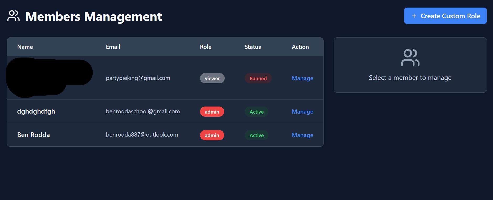
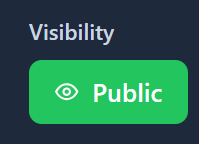
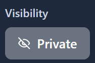

# 🔐 CodeVault V2

A modern, modular shared library and codebase for **website development** and **technology projects**. CodeVault provides streamlined, reusable code to help developers build faster and collaborate more effectively.

## ✨ Features

- **Centralized Shared Code** - Organize reusable components in one place
- **Multi-Language Support** - Primarily TypeScript with PLpgSQL, CSS, JavaScript, and HTML
- **Modular Design** - Easy integration and extension for any project
- **Production-Ready** - Actively maintained, versioned, and tested
- **Developer Friendly** - Clear code structure and API documentation
- **Type-Safe** - Full TypeScript support with comprehensive types

## 🚀 Quick Start

### Prerequisites
- Node.js (v16 or higher)
- npm or yarn

### Installation

```bash
# Clone the repository
git clone https://github.com/theexistancemc/codevault.git
cd codevault

# Install dependencies
npm install
```

### Basic Usage

```typescript
// Import required modules
import { MyComponent } from './src/components';

// Use in your project
const instance = new MyComponent();
```

For detailed usage, check the `/docs` directory or explore the code structure.

## 📊 Project Statistics

| Language | Percentage |
|----------|------------|
| TypeScript | 89% |
| PLpgSQL | 6.7% |
| CSS | 2.7% |
| JavaScript/HTML | 1.6% |

## 📸 Screenshots

### Admin Dashboard


### Member Admin View


### Code Visibility Settings



### Desktop View


## 🌐 Live Demo

**Check out the live site:** [https://codevault.bolt.host/](https://codevault.bolt.host/)

> ⚠️ **Note:** The website is currently in **beta**. Features may change and bugs may exist. Please report issues on GitHub.

## 📦 Latest Release

**Version 2.0.0** - Released Dec 3, 2025

See all [releases](https://github.com/theexistancemc/codevault/releases) for version history.

## 📖 Documentation

- **API Docs** - Check the code comments and `/docs` folder
- **Architecture** - See individual component files for structure
- **Setup** - Refer to this README or `/docs` directory

## 🤝 Contributing

Contributions are welcome! Here's how to help:

1. **Fork** the repository
2. **Create a branch** for your feature (`git checkout -b feature/amazing-feature`)
3. **Commit changes** with clear messages
4. **Push to your branch** (`git push origin feature/amazing-feature`)
5. **Open a Pull Request** - For major changes, please open an issue first

## 📝 License

Copyright © 2025 by **theexistancemc**

This code is provided under the terms specified in the repository. See the [LICENSE](./LICENSE) file for full details.

## 🔗 Links

- **GitHub Repository** - [theexistancemc/codevault](https://github.com/theexistancemc/codevault)
- **Live Website** - [codevault.bolt.host](https://codevault.bolt.host/)
- **Issues & Discussions** - [GitHub Issues](https://github.com/theexistancemc/codevault/issues)

---

**Made with ❤️ by theexistancemc**
